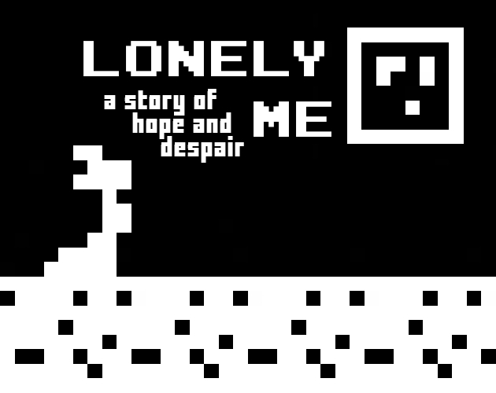

# Lonely Me

*A story of hope and despair*
*Submission to 1-BIT JAM*

[License](https://github.com/FTEdianiaK/Lonely-Me/blob/main/LICENSE) | [Asset License](https://creativecommons.org/licenses/by-sa/4.0/)

### About

**Made in one (1) day for the 1-BIT JAM, the topic was "Light & Dark"**

*(in this case interpreted as "Hope & Despair")*

Embark on a journey across the (side) planet of Myesic and listen to the tale of the lonely Me, who hopes to one day meet their future bestie from Zemye. Help Me construct a device called Playta, that will hopefully be able to reach Zemye. Just steer clear of the sinister looking DPU.

### How to...

**Play:**
- Visit my [Itch](https://edianiak.itch.io/lm) for more information.

**Re-code:**
- Grab a zip of the whole repository using the 'Code' button above.
- Alternatively, use 'git clone'.
- Open using [Bitsy](https://ledoux.itch.io/bitsy).

### Known Bugs
- None yet... Report them [here](https://github.com/FTEdianiaK/library-parrotex/issues).

### Credits

**Engine:** [Bitsy - by Adam Le Doux - MIT](https://ledoux.itch.io/bitsy)

**Music:** [Music Grid - by Irshad PI - MIT](https://music-grid.surge.sh/)

**Sound effects:** [sfxr - by DrPetter - MIT](https://www.drpetter.se/project_sfxr.html)

**Bitsy hacks:**

Introduced via: [Borksy - by AYolland - MIT](https://andrewyolland.com/borksy/)
- Bitsymuse - by David Mowatt
- Close on ending, Dynamic background, Long dialog - by Sean S. LeBlanc
- favicon-from-sprite - by @mildmojo
